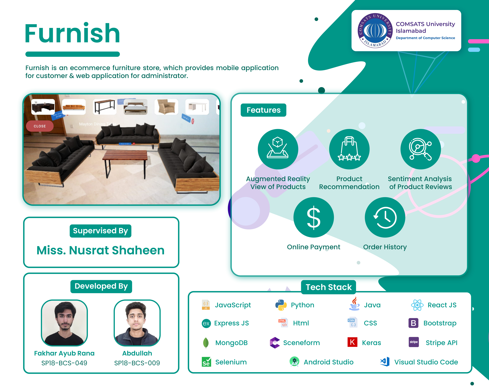

# Final Year Project: Furnish
## Description
Furnish is an ecommerce furniture store, which provides mobile application for customer & web application for administrator. 

## Features
- Augmented Reality View of Products
- Product Recommendation
- Sentiment Analysis of Product Reviews
- Online Payment
- Order History

## Tools and Technologies

| Tools and Technologies       | Version           | Rationale  |
| ------------- |:-------------:|-----|
| JavaScript| ES6| Programming Language |
| Python| 3.9.5| Programming Language |
| Java SE| 16.0.1| Programming Language |
| React JS| 17.0.2| Frontend Web Development |
| Express JS| 4.16.1| Backend Development |
| Html| 5| Web Development |
| CSS| 2| Web Design |
| React Bootstrap| 1.5.2| Web Design |
| MongoDB| 4.4.4| Database |
| Sceneform| -| For Augmented Reality |
| Model Viewer| 1.6.0| To Display 3D Model In Browser |
| Keras| 2.4.0| Review Analysis | |
| Selenium Webdriver| 4.1.0| Automated Testing |
| Android Studio| 4.2| Frontend Mobile Development |
| Visual Studio Code | 1.63| Code Editor |

## Banner
